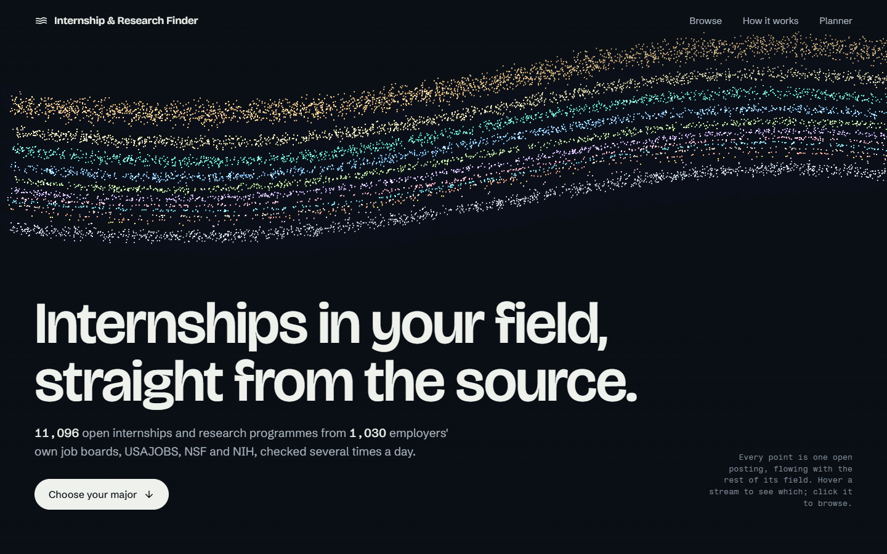
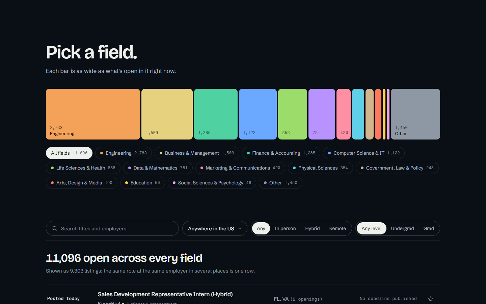
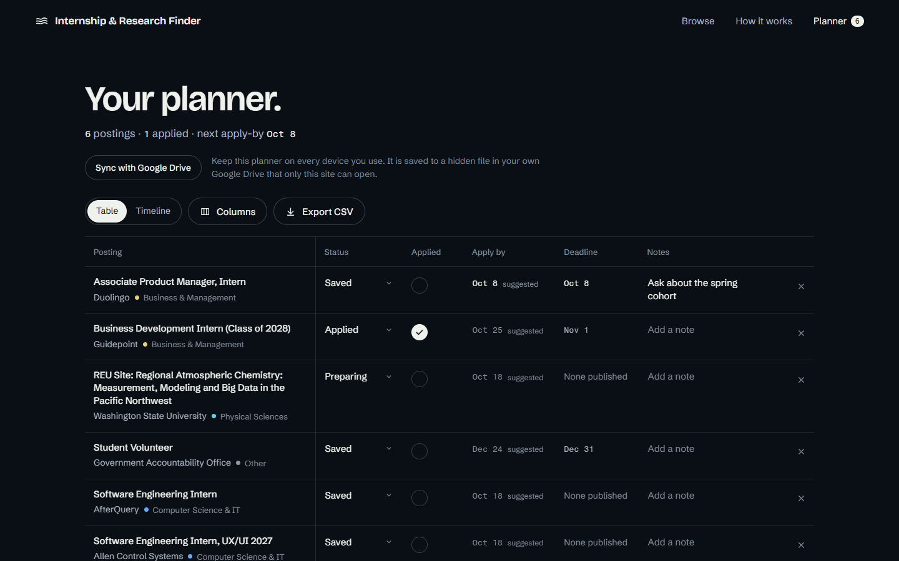
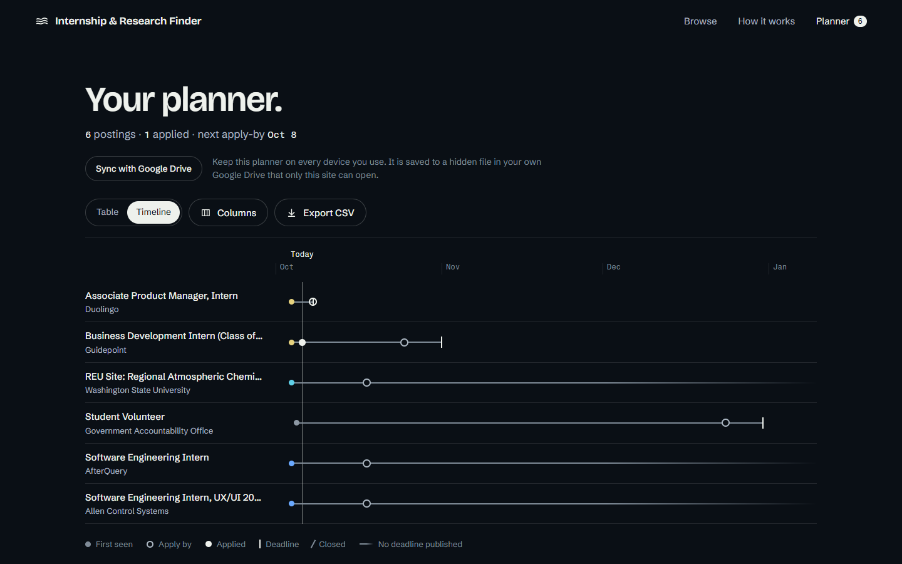
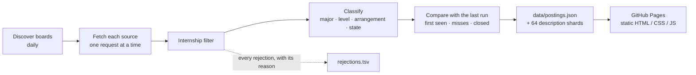

# Internship & Research Finder

Live internships and funded research programmes for US college students, read straight from employers' own job boards and federal sources, grouped by major, with a planner to track applying.

**[Open the site](https://patharearya.github.io/internship-tracker/)** · [Planner](https://patharearya.github.io/internship-tracker/planner.html) · [Privacy](https://patharearya.github.io/internship-tracker/privacy.html)



## Why

Students check dozens of career pages to catch internships the moment they open, because early applicants are seen first. Postings are scattered across employers' own sites, and no single place shows, for a student's own major, what is open now and when it opened.

This site gathers them in one place. It uses first-party sources only (employers' own job boards, USAJOBS, NSF and NIH), never aggregators. It also records, from its own monitoring, when each posting first appeared and when it closed.

As of October 6, 2026 it lists **about 11,100 open postings** from the job boards of about 1,030 employers, plus USAJOBS, NSF and NIH. It watches 2,205 boards in all.

## What it does

**Browse by major.** Every open posting is one point in the river on the first screen, flowing in its field's stream. Below it the same data turns into a working list:

- Pick a field from a strip of bars sized by how much is open.
- Filter by state or remote, arrangement and level, and search titles and employers.
- Open any posting for its full description and a link to the employer's own page.



**Plan and track.** Star postings while browsing, and the [planner](https://patharearya.github.io/internship-tracker/planner.html) lays them out as a spreadsheet:

- **Columns you choose:** status, an Applied checkmark, date applied, follow-up date, notes, contacts, a materials checklist, days open and more, each switched on or off with tick pills.
- **Suggested apply-by dates:** a week before the published deadline, or two weeks after the posting first appeared when no deadline is published. Each one is labelled as a suggestion.
- **The Applied tick** stamps today's date and moves the status on in one motion.
- **Closed postings** are marked from the site's own records ("Closed Oct 5").
- **Also:** sorting, CSV export, and a timeline view of the season against today.





**Sync across devices, without an account.**

- The planner lives in the browser by default.
- "Sync with Google Drive" keeps it in one hidden file in the student's *own* Google Drive. Only this site can open that file, using Google's non-sensitive `drive.appdata` permission.
- There is no server and no database, and the project never receives anyone's data. See the [privacy page](https://patharearya.github.io/internship-tracker/privacy.html).

## Where the data comes from

| Source | What it gives | Open postings (Oct 6, 2026) |
|---|---|---|
| Workday | Employers' own career sites: banks, consultancies, hospitals, manufacturers, retailers | 7,954 |
| Greenhouse | Employers' own job boards, mostly tech | 1,405 |
| Ashby | Employers' own job boards, mostly startups | 489 |
| Lever | Employers' own job boards | 249 |
| NSF Award API | Active REU Site awards: funded undergraduate research | 722 |
| NIH RePORTER | R25 summer research programmes for undergraduates | 221 |
| USAJOBS API | Federal internships, with real closing dates | 56 |

**How boards are found.** Employer boards come from the application links in the [SimplifyJobs](https://github.com/SimplifyJobs/Summer2027-Internships) list. Only the mapping of company to hiring system to board is extracted; none of the list's content is reused. Every board is validated live.

**Hand-added boards.** 14 boards were added by hand for majors the list leaves thin, such as RAND, Pew Research Center, Teach For America and College Board.

**Deliberately not used:**
- aggregators (The Muse, Adzuna);
- sites whose robots.txt or terms forbid it (SmartRecruiters, NEOGOV, LinkedIn, Handshake, Indeed, Glassdoor);
- university pages.

## How it works

One Java program runs on GitHub Actions. It writes JSON files into `data/`, and a static page reads them. There is no server, no database and no AI in the pipeline.



- **Schedule.** Automatic, several times a day; see [How often the data updates](#how-often-the-data-updates).
- **Filter.** A title must name the role: intern, internship, co-op, apprenticeship, fellowship, student trainee, "summer analyst" or a dated term like "Summer 2027". Research awards skip this step.
  - It then rejects new-grad, entry-level and early-career jobs, postdocs and senior or clinical fellowships, and people who run internship programmes ("Internship Program Manager").
  - It also rejects DoD SkillBridge roles (for service members only), USAJOBS postings closed to students, and roles outside the US.
  - Word boundaries keep out false hits such as "internal" and "international".
- **Classification.** Keyword rules sort each posting into one of 12 majors plus Other, from the title and department. The work decides, not the employer's industry. USAJOBS maps by occupational series and NSF by directorate.
  - Level (undergrad / grad / both / not stated) and arrangement (in person / hybrid / remote / not stated) come from keywords.
  - State comes from a location parser: state names and codes, a city table, and the US Census places list.
  - Every label records the rule and text that produced it.
- **Closing.** A posting closes only after three consecutive successful fetches without it. A failed fetch counts as no evidence. A sudden drop to near zero is held as an anomaly until it repeats.
  - Closed postings stay listed in the data for 14 days, so starred ones still resolve.
  - A board failing for 7 days has its postings closed.
- **Politeness.** Every request identifies the project and a contact address. Each source gets one request at a time. Failing boards back off exponentially, a 403 or 429 pauses that server, and robots.txt is respected.
- **Large data.** `postings.json` is about 14 MB (0.8 MB compressed). Full descriptions are split into 64 files by a hash of the posting key, which the page computes the same way, so one is fetched only when a posting is opened.

## How often the data updates

**Automatically, about 4–5 times a day.** Nobody has to run anything.

- **The schedule.** The `update` workflow asks GitHub to run it every hour, but GitHub only fires some scheduled slots when its servers are busy. In practice there are 2 to 7 hours between runs.
- **After each run,** it commits the new data to `data/` and the site redeploys itself. A newly posted internship usually appears within a few hours, and almost always the same day.
- **The date of the data** the site is showing is in its footer ("Posting data from the update started …").

| Day (UTC) | Scheduled runs |
|---|---|
| October 5, 2026 | 01:59, 09:02, 14:17, 18:26 |
| October 6, 2026 | 00:48, 07:33, 13:10, 15:10, … |

**What each run covers:**

| Part | How often | Time it takes |
|---|---|---|
| Greenhouse, Lever, Ashby, USAJOBS, NSF, NIH | Every run | About 5 minutes |
| Workday (about 1,170 employers, about 70% of postings) | When 3 hours have passed since its last Workday run, so about every other run | About 1 hour |
| The list of employer boards, rebuilt from the Simplify list | Once a day (06:05 UTC) | A few minutes |

**To update right now:** open the repository's **Actions** tab, choose **update**, then **Run workflow**. This is optional; the schedule keeps going without it.

**If updates stop:** GitHub disables scheduled workflows in a public repository after 60 days without activity. The data commits each run makes should count as activity. If the date in the site's footer stops moving, open the **Actions** tab, and if the `update` workflow shows as disabled, click **Enable workflow**.

## Repository layout

```
src/main/java/.../internships/
  Discover.java   board discovery from the Simplify list, hand-added boards, Workday host fixes
  Fetch.java      one adapter per source: Greenhouse, Lever, Ashby, Workday, USAJOBS, NSF, NIH
  Parse.java      each source's JSON -> one Posting record
  Rules.java      internship filter, major, level, arrangement, US location
  Main.java       the run: fetch, filter, label, merge with the last run, close, write data/
src/test/         JUnit tests replaying saved raw responses (src/test/resources/raw/)
site/             the public site: index.html, planner.html, privacy.html, style.css, app.js,
                  planner.js, sync.js (+ sync.test.mjs)
data/             written by the hourly job: postings.json, descriptions/, boards.json, state.json, report.json
docs/             brief.md (decisions), devlog.md (defects), tasks.md, images/
.github/workflows update.yml (the hourly job), pages.yml (publishes site/ and data/)
DESIGN.md         the visual design system the pages follow
```

## Run it yourself

Requirements: Java 21 (Maven comes with the wrapper) and Node 18+ for the front-end test. Any static file server works for the site.

```bash
./mvnw test                          # 39 JUnit tests, replaying saved responses (no network)
node site/sync.test.mjs              # the planner's Drive-sync merge rules

# a full run (network, about 1 hour with Workday)
export CONTACT_EMAIL=you@example.com # sent in the User-Agent, as the politeness rules require
export USAJOBS_API_KEY=...           # free key from developer.usajobs.gov
./mvnw -q compile exec:java -Dexec.mainClass=io.github.patharearya.internships.Main -Dexec.args=discover
./mvnw -q compile exec:java -Dexec.mainClass=io.github.patharearya.internships.Main -Dexec.args=run

# the site: serve site/ with data/ beside it
ln -s ../data site/data              # on Windows: mklink /J site\data data
python -m http.server 8765 -d site   # http://localhost:8765
```

In GitHub Actions the contact email and USAJOBS key come from repository secrets, and Pages is set to deploy from Actions.

## How it was checked

The project follows a few working rules: measure instead of assuming, keep a control beside a change, and break each test on purpose once to prove it can fail.

- **Replay, not live calls.** Tests run against raw responses saved during the first spike, so they are fast, repeatable and can't be skewed by a source changing. Rule changes are replayed over the full saved run before shipping, and every changed posting is read.
- **A hand-labelled sample.** The owner labelled 297 real postings, which are checked against the filter and major rules on every change (`LabelledSampleTest`).
  - The first round showed the rules' answers pre-filled, and an unchanged pre-fill looked the same as agreement.
  - The majors were relabelled blind in a second round (148 rows).
  - Some first-round labels that agree with the rules may still be unchecked pre-fills; [docs/tasks.md](docs/tasks.md) says so.
- **Every rejection is logged** with its reason, so "3 results from 30" can be told apart from a broken lookup.
- **A dev log of 28 defects** ([docs/devlog.md](docs/devlog.md)). Each entry records what broke, what was first thought to be wrong (usually not the cause), and the measurement that settled it. Examples:
  - NSF's API returns a different 96% of awards on each pass.
  - One employer's 403 once paused all 1,158 Workday boards.
  - Workday reports `total: 0` on later pages.
  - A screen-reader label widened every phone page to 866 px.
- **The pages** were checked in headless Chrome during development, against both the live site and local copies. This covered 16 planner flows, 17 sync cases (with Google and Drive faked) and measured page widths at phone size. Those scripts were working tools and are not kept in the repo; the sync merge rules have a test that is (`site/sync.test.mjs`).
- **Design review.** The pages went through an independent design review until the reviewer returned "ship".

## Limits, stated plainly

- **Not every internship.** It covers employers whose public boards can be read, plus three federal sources. The employer boards lean toward tech, engineering and business. Education and Social Sciences have about 50 open postings each, and the site says so.
- **A sample on the biggest boards.** On the largest Workday boards, the "intern" search is read up to 200 results, plus each board's own internship category in full. A category over 500 jobs, such as CVS's 3,000+ store pharmacy internships, is sampled rather than read whole.
- **Missing states.** About 330 open postings have no US state the parser can read ("United States", "Any SpaceX site", site names), so state filters hide them.
- **Major labels come from keywords.** They are not perfect. Postings whose titles name no field land in Other, which is always shown.
- **No reminders.** Drive sync asks for one click per visit, because browsers block Google's sign-in window without a click.

## How it was built

Built between October 2 and October 6, 2026.

1. **Spike.** A project brief was settled by working through every design decision in a question-and-answer session, recorded in [docs/brief.md](docs/brief.md). A one-day spike then fetched one real example from every source before any code depended on it.
2. **Pipeline.** Adapters, rules and the merge and close logic came next.
3. **Pages.** The public page was designed with the Impeccable design workflow (direction, build, independent finish review), and its system is recorded in [DESIGN.md](DESIGN.md).
4. **Planner and sync.** These came last.

The code was written with Claude Code as a pair programmer, and the code commits carry its co-author line. Decisions, labels and acceptance were the owner's.

## License

The code is released under the [MIT License](LICENSE).

The postings in `data/` are not covered by it. They belong to the employers and agencies that publish them, and every one links to its original page, where students apply.
